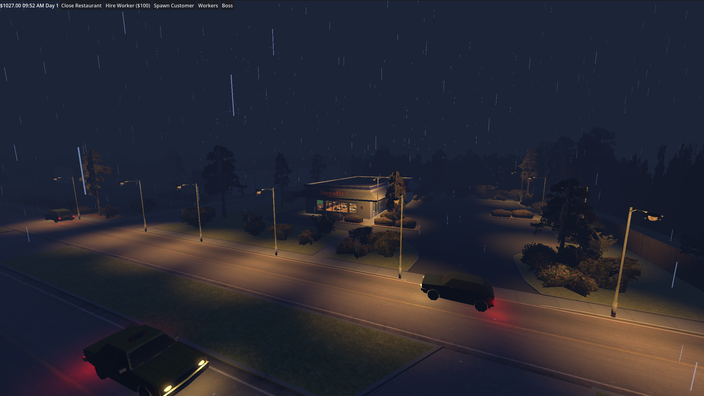
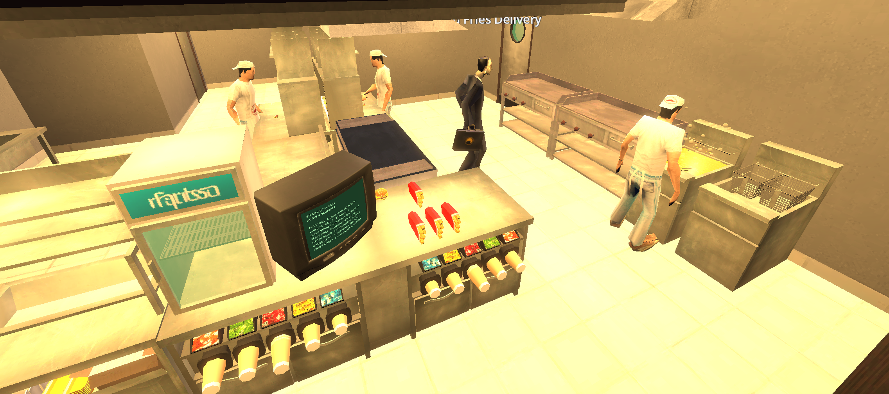
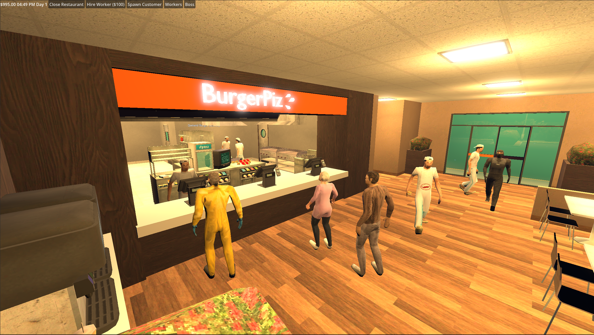
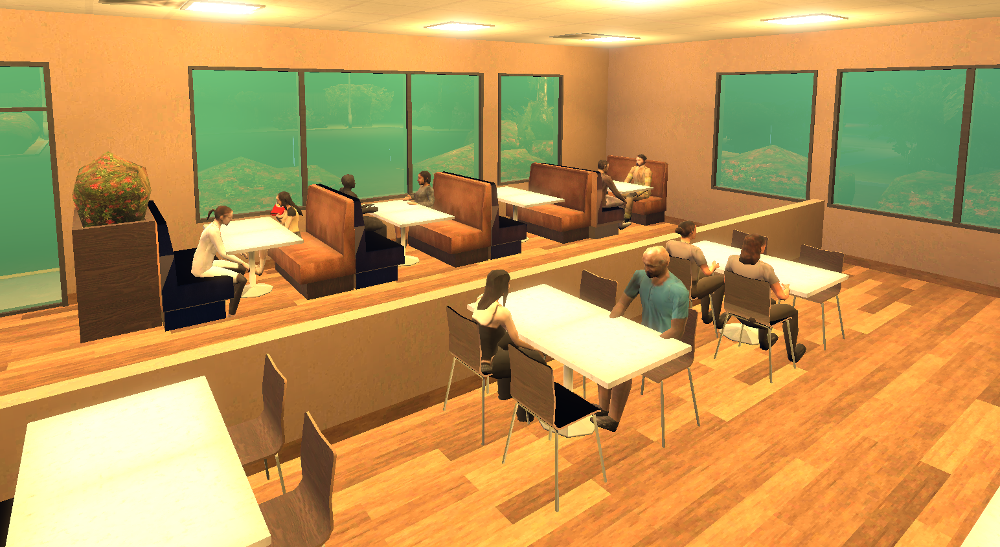
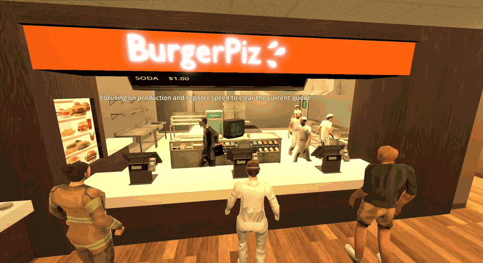
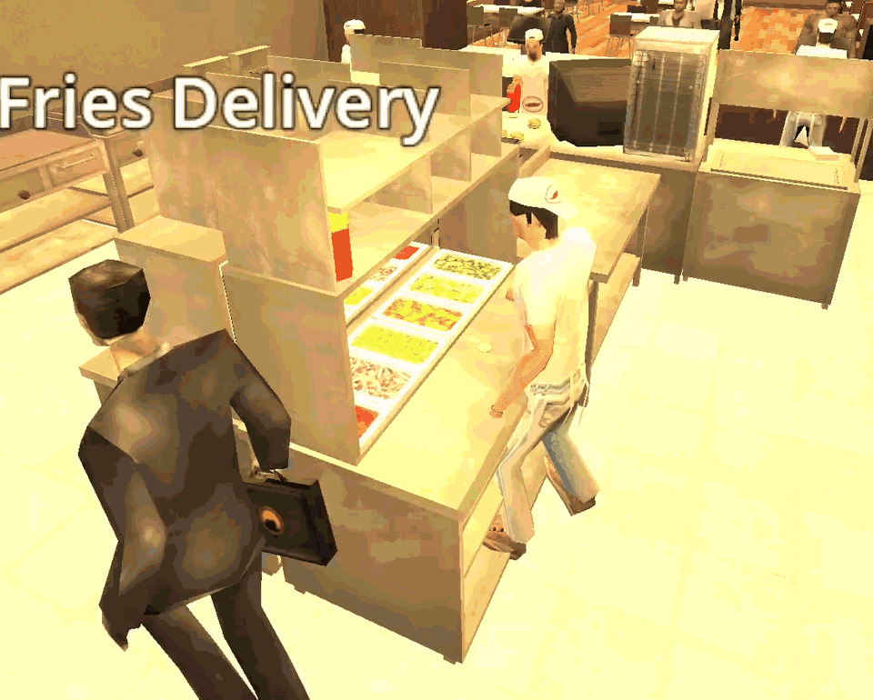
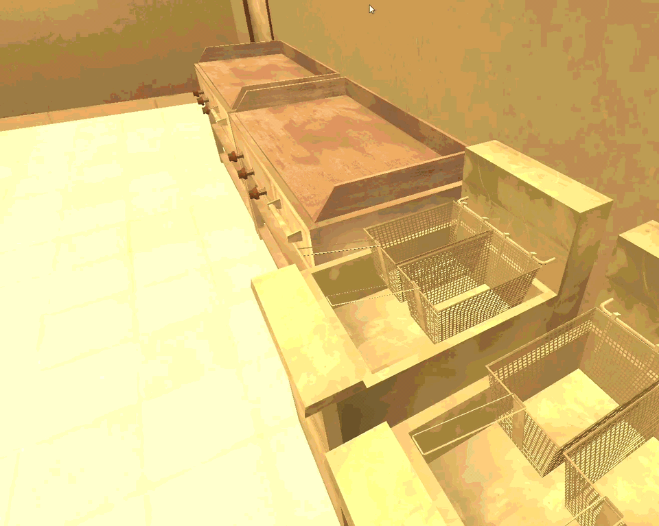

# Bit Market

Name: Keith Salhani

Student Number: C22322811

Class Group: TU857

# Description

Bit Market is a 3D restaurant management and automation simulation built in Godot 4.6. The project is set inside a low-poly/PSX-style burger restaurant where customers arrive, queue at cash registers, place orders and pay, sit down, wait for food, eat, and leave.

The main gameplay focus is the worker-driven restaurant pipeline. Workers can be hired and assigned roles such as cashier, meat griller, burger prepper, fries fryer, and caterer. Each worker pulls tasks from a shared task manager and uses navigation, station reservations, hand IK, food props, and kitchen station logic to complete the customer order flow.

The simulation also includes a physical boss manager NPC. The boss walks around the restaurant, inspects nearby zones, remembers partial observations, interviews workers, and can use a Gemini LLM to choose management plans. The plans are validated by Godot before they can change worker roles, queue food backlog, hire or fire staff, change prices, or show boss speech.

The simulation includes burger assembly, meat grilling, fries frying, register queues, seat assignment, food storage, delivery, eating animations, menu pricing, worker performance stats, money tracking, slower day/time progression, and HUD/debug interfaces for observing the running system.

The current restaurant scene is also staged as a rainy night environment. It uses fog, runtime fixture lighting, lamppost lighting, roof-aware rain particles, muffled indoor rain audio, kitchen/register VFX, and simple road traffic with lit vehicles to make the restaurant feel active outside the core management loop.

## Video

[](https://youtu.be/0DrXUjW8uA4)

## Screenshots



Resteraunt overview



Kitchen



Queue



Customers eating

## Animations



Kitchen



Burger assembly



Fries frying

[Grill](readme/docs/animations/grill.gif)

Grilling

## Audio

The game uses imported audio assets for payment, kitchen/station feedback, eating, rain ambience, and traffic ambience.

Implemented audio assets include:

- [Register payment sound](assets/audio/applepay.mp3)
- [Register/kitchen beeping sound](assets/audio/mcdonalds-beeping-sound.mp3)
- [Customer eating chips sound](assets/audio/freesound_community-eating-chips-81092.mp3)
- [Cooking/fire swoosh sound](assets/audio/gregorquendel-designed-fire-winds-swoosh-04-116788.mp3)
- [Restaurant music loop](assets/audio/sergequadrado-fun-hop-loop-394917.mp3)
- [Rain ambience](assets/audio/dragon-studio-gentle-rain-07-437321.mp3)
- [Vehicle engine loop](assets/vehicles/Sound%20effects/Car_Engine_Loop.ogg)
- [Vehicle engine loop 2](assets/vehicles/Sound%20effects/Car_Engine_Loop_2.ogg)
- [Vehicle 2 engine loop](assets/vehicles/Sound%20effects/Car2_Engine_Loop.ogg)
- [Vehicle 2 engine startup](assets/vehicles/Sound%20effects/Car2_Engine_Start_Up.ogg)
- [Vehicle 2 engine turning off](assets/vehicles/Sound%20effects/Car2_Engine_Turning_Off.ogg)
- [Vehicle drive/acceleration sound](assets/vehicles/Sound%20effects/Car_Acceleration.ogg)
- [Vehicle drive/acceleration sound 2](assets/vehicles/Sound%20effects/Car_Acceleration_2.ogg)

# Instructions

1. Install Godot `4.6.1` or a compatible Godot 4.6 build.
2. Open the project folder in Godot.
3. Run the default scene:

```text
res://scenes/world/burger_level.tscn
```

The main scene is already configured in `project.godot`.

## LLM Configuration

The boss manager works without an API key, but in that mode it only patrols, observes, logs, applies local execution helpers, and waits for a valid LLM configuration.

To enable Gemini:

1. Copy `config/llm.example.json` to `config/llm.local.json`.
2. Set `enabled` to `true`.
3. Replace `YOUR_GEMINI_API_KEY` with a real Gemini API key.
4. Optionally change `model`, for example to another Gemini Flash or Flash-Lite model.

Example local config:

```json
{
  "provider": "gemini",
  "model": "gemini-3.1-flash-lite",
  "api_key": "YOUR_GEMINI_API_KEY",
  "timeout_seconds": 12,
  "enabled": true,
  "debug_raw_json": false
}
```

`config/llm.local.json` is ignored by Git and should never be committed. The boss writes debug events to `user://boss_manager_debug.jsonl`, which resolves to the Godot user-data folder for the project.

## Controls

- `Open Restaurant`: starts the day and begins customer spawning.
- `Close Restaurant`: stops the restaurant from accepting new time progression.
- `Hire Worker ($100)`: hires another worker. The first worker is free.
- `Spawn Customer`: manually spawns a customer for testing.
- `Workers`: opens the worker activity panel.
- `Boss`: opens the boss manager panel with overview, LLM, worker metrics, restaurant metrics, validation, and raw event views.
- Worker role dropdowns: assign workers to Auto, Cashier, Meat Griller, Burger Prepper, Fries Fryer, or Caterer.

Free camera controls:

- `WASD`: move camera
- Right mouse drag: rotate camera
- `Space`: move up
- `Ctrl` or `C`: move down
- `Shift`: move faster
- `Esc`: release mouse / toggle debug behavior

# How It Works

The restaurant simulation is built around a set of managers and station scripts.

`RestaurantManager` tracks the restaurant state: money, day number, time of day, whether the restaurant is open, menu prices, and service metrics. Customers pay the current menu price immediately when the cashier takes their order. The manager also records orders placed, orders delivered, orders per in-game hour, and average order-to-delivery time.

`CustomerManager` spawns customers, randomises their visual character, assigns them to available register slots, and manages register queue positions when all registers are occupied. If workers are assigned to specific registers, waiting customers are rebalanced toward staffed registers instead of standing at an unused register.

`CustomerAI` controls the full customer lifecycle. Customers enter, queue for a register, request an order task, pay for their selected order, find a seat, wait for delivery, receive food, eat, and leave.

`TaskManager` is the central task queue. It creates and assigns tasks for processing orders, cooking meat, frying fries, assembling burgers, and delivering food. It also checks worker roles, station availability, station reservations, food availability, and delivery reservations. It exposes task-change signals so UI displays and boss metrics can react to active and pending work.

`WorkerAI` runs on each worker NPC. Workers request tasks, travel to the correct station, snap into workstation positions, perform reach/IK interactions, carry food, stock the food table, and deliver the correct food type to customers. Workers also have generated stats, including speed multipliers and delivery capacity, and record observed performance such as orders per minute, burgers per minute, meat batches per minute, fries per minute, deliveries per minute, average task durations, failures, and observed carry count.

`BossAI` runs on the boss NPC. It patrols registers, grill, fryer, prep, food table, dining room, and workers. Each stop adds summarized observations to `BossKnowledge`, with timestamps, confidence, and stale/unknown labels. When the restaurant opens, the boss interviews the starting crew to learn delivery capacity before requesting an opening management plan.

`GeminiLLMClient` is a direct Godot HTTP client for Gemini. It loads `config/llm.local.json`, sends prompts to the Gemini `generateContent` endpoint, requests strict JSON output, and reports failures without printing the API key.

`HUD` includes the Boss Manager panel. The panel shows the boss destination, LLM availability, next plan timing, stale zones, overview details, raw prompt/response, worker metrics, restaurant metrics, validation results, and a clickable event list for debugging each LLM and local execution action.

Kitchen stations provide the physical food production logic:

- `GrillStation`: cooks batches of meat, shows meat props, emits smoke/ember/heat VFX while cooking, and adds a small fill light so meat stays readable in the night scene.
- `BurgerAssemblyStation`: builds burgers from individual ingredient props, requires cooked meat stock, stores finished burgers, and emits small ingredient/finished-food bursts.
- `FryerStation`: lowers baskets, shows oil, spawns raw fries, emits steam/oil/heat VFX, and creates bagged fries.
- `FoodTableStation`: stores prepared food by type, exposes food lookup for delivery tasks, and emits placement/removal bursts.

`RestaurantAtmosphere` controls the visual and audio mood of the burger level. It sets the rainy night environment, keeps the foggy look, creates runtime lights from imported restaurant fixtures and lamppost markers, spawns rain outside and above the roof, and muffles the rain sound when the camera is inside the restaurant boundary. The boundary is derived from the front door, back windows, left windows, and right-side door nodes in the BurgerPiz map.

`RestaurantVFXFactory` provides reusable VFX helpers for short bursts, steam, embers, heat shimmer, and small temporary lights. The station scripts call into it instead of each station building its own particle setup from scratch.

The road traffic system is made from `TrafficManager` and `TrafficVehicle`. The manager reads lane markers from the `Road` node in the burger level, spawns low-poly vehicles into four lanes, and moves them between lane endpoints. Each vehicle has separated wheel meshes so the wheels can spin while driving, plus 3D engine/drive loops, headlight beams, front lens glow, and red rear lights for the night environment.

Movement and interaction use Godot navigation, station markers, seat/register markers, and `SkeletonIK3D`-based reaching. Workers, customers, and the boss use separate movement scripts so the simulation can run autonomously once the restaurant is open.

## Boss Manager And LLM

The boss manager is intentionally not given raw omniscient truth as its main decision context. The prompt is built from boss memory, stale/unknown labels, explained metrics, legal action options, recent actions, and restaurant state. Worker hidden stats are not dumped directly into the prompt; the boss learns worker capability through observation and opening interviews.

The LLM returns one `manager_plan` JSON object:

```json
{
  "action": "manager_plan",
  "reason": "short reason",
  "staffing_plan": [
    {"worker": "Worker_1", "role": "cashier", "reason": "register pressure"}
  ],
  "stock_targets": {"burger": 2, "fries": 2, "meat": 8},
  "hire_worker": false,
  "fire_worker": "",
  "say": "short speech"
}
```

Godot validates every part of the plan before applying it:

- worker names must exist.
- roles must be one of `auto`, `cashier`, `meat_griller`, `burger_prepper`, `fries_fryer`, or `caterer`.
- busy workers receive pending role changes instead of being interrupted.
- hiring requires enough money and a staffing-pressure reason.
- firing cannot remove the last worker and requires observed underperformance or overstaffing.
- price changes are bounded and have a cooldown.
- stock targets are capped to small safe backlogs.
- when cooked meat is overstocked, assigning more meat grilling is rejected so the LLM can move that worker to burger prep or another bottleneck.

The local execution tick is not a competing manager. It applies accepted pending role changes, keeps assigned grillers working toward meat backlog under the overstock threshold, and queues delivery tasks when ready food exists. If Gemini is disabled, fails, times out, or returns invalid JSON, the boss keeps walking and observing but does not apply a new LLM management plan.

## RK/IK Worker Interaction

The worker kitchen interactions use a combination of regular keyframed character movement and procedural inverse kinematics. The worker still moves around the restaurant with the normal navigation and locomotion animations, but when they arrive at a workstation the right arm is controlled by a dedicated reach controller.

The main script for this is `src/movement/worker_reach_controller.gd`. It creates a `SkeletonIK3D` node at runtime, targets the worker skeleton from `RightUpperArm` to `RightHand`, and moves a hidden `RightHandIKTarget` node to world-space interaction points. The target is animated with tweens so the arm reaches smoothly rather than snapping.

This is used heavily at the prep station. The burger prep station has reach targets for ingredients such as meat, cheese, pickles, onion, lettuce, buns, and the final burger assembly point. For each ingredient, the worker reaches to the ingredient location, moves to the burger stack position, places the layer, and returns to a rest pose. The prep station also passes a custom hand rotation so the hand faces down toward the burger while placing ingredients.

The same reaching system is reused across other stations:

- At the grill, the worker reaches to pick/place raw meat and later reaches back to collect cooked meat.
- At the fryer, the worker reaches to basket handle markers before lowering and raising the baskets.
- At the food table, the worker reaches to place burgers/fries into storage slots.
- During delivery, food is attached to the worker hand with `BoneAttachment3D`, carried to the customer, then handed over.

I refer to this as RK/IK in the project notes because the final motion is a blend of authored/regular character motion and runtime IK correction. The body and navigation are driven normally, while the arm pose is procedurally solved toward exact station markers. This made the kitchen loop more convincing without needing a unique baked animation for every ingredient, station, and food item.

## Code Examples

### Role-Based Task Assignment

Workers do not directly decide what job to perform. Instead, `TaskManager` checks the worker's assigned role, station ownership, station availability, and task dependencies before assigning work.

```gdscript
func get_next_task(worker: Node) -> Task:
	if pending_tasks.is_empty():
		return null
	
	var ai = worker.get_node("WorkerAI") if worker.has_node("WorkerAI") else null
	var role = ai.job_role if ai else ROLE_AUTO
	
	var i := 0
	while i < pending_tasks.size():
		var task = pending_tasks[i]
		if _can_worker_do_task(role, task.type):
			_assign_task_station_for_worker(worker, role, task)
			if not _task_matches_worker_station(worker, role, task):
				i += 1
				continue
			if _station_has_active_task(task):
				i += 1
				continue
			if _task_station_is_unavailable(task):
				i += 1
				continue

			pending_tasks.remove_at(i)
			task.assigned_worker = worker
			task.status = "in_progress"
			active_tasks.append(task)
			return task
		i += 1
	return null
```

This means a cashier only takes register tasks, a meat griller only takes grill tasks, and Auto workers can fill gaps while respecting specialist station ownership. The task manager also reassigns burger and fries production tasks to the station owned by the compatible worker, which lets multiple prep shelves work correctly.

### Customer Ordering Flow

Customers request a register slot, wait until they reach their assigned register marker, then create a process-order task. After the cashier takes the order, the customer chooses either burger or fries and creates the correct kitchen task.

```gdscript
func take_order(worker: Node) -> void:
	if _has_ordered: return
	_has_ordered = true
	_ordered_at_seconds = Time.get_ticks_msec() / 1000.0
	ordered_food_type = _choose_order_type()
	_show_order_label()
	_collect_order_payment()
	var rm := get_node_or_null("/root/RestaurantManager")
	if rm != null and rm.has_method("record_order_placed"):
		rm.call("record_order_placed")
	
	var level = customer.get_tree().current_scene
	var prep_station = _choose_burger_prep_station(level)
	var fryer_station = level.find_child("Fryer_1", true, false)
	var food_table = level.find_child("FoodTable", true, false)
	
	if food_table != null:
		if ordered_food_type == FOOD_BURGER and prep_station != null:
			tm.add_task(tm.TaskType.ASSEMBLE_BURGER, {"station": prep_station, "food_table": food_table, "customer": self, "food_type": ordered_food_type})
		elif ordered_food_type == FOOD_FRIES and fryer_station != null:
			tm.add_task(tm.TaskType.FRY_FRIES, {"station": fryer_station, "food_table": food_table, "customer": self, "food_type": ordered_food_type})
```

### Register Queuing System

`CustomerManager` keeps a list of register slots and a separate waiting queue. Customers are added to the queue first, then assigned to open register markers when a compatible slot is available. If cashiers are assigned to specific registers, the manager periodically rebalances waiting customers away from unstaffed registers and toward staffed ones.

```gdscript
func request_register_slot(customer_ai: Node) -> void:
	if customer_ai == null or not is_instance_valid(customer_ai):
		return
	_prune_register_state()
	_ensure_register_slots()
	if not _register_queue.has(customer_ai) and _get_customer_register_slot_index(customer_ai) == -1:
		_register_queue.append(customer_ai)
	if _register_slots.is_empty():
		call_deferred("_retry_register_assignment")
		return
	_assign_open_registers()
	_update_register_queue_positions()

func _assign_open_registers() -> void:
	_prune_register_state()
	var i := 0
	while i < _register_slots.size():
		if _register_queue.is_empty():
			return
		var slot := _register_slots[i]
		if slot.get("customer") != null:
			i += 1
			continue
		if not _register_slot_can_accept_customer(i):
			i += 1
			continue
		var customer_ai := _register_queue.pop_front() as Node
		if customer_ai == null or not is_instance_valid(customer_ai):
			continue
		_register_slots[i]["customer"] = customer_ai
		_remove_queue_marker(customer_ai)
		if customer_ai.has_method("go_to_register"):
			customer_ai.call("go_to_register", slot.get("marker"))
		i += 1
```

Queue marker positions are generated at runtime from the average register positions, so the visible line follows the restaurant layout instead of relying on hardcoded world coordinates.

### Worker Execution Loop

Each worker continuously asks the task manager for work. When a task is assigned, the worker runs the correct task routine and then returns to an idle station.

```gdscript
func _start_task_loop() -> void:
	var task_manager = get_node("/root/TaskManager")
	while is_inside_tree():
		if not _is_executing:
			var task = task_manager.get_next_task(_worker)
			if task != null:
				_is_executing = true
				_current_task = task
				_set_task_status(task, "Starting", "Task assigned")
				await _execute_task(task)
				task_manager.complete_task(task)
				_current_task = null
				_is_executing = false
				_set_idle_status()
				_move_to_assigned_idle_station()
			else:
				_set_idle_status()
				_move_to_assigned_idle_station()
				await get_tree().create_timer(0.5).timeout
		else:
			await get_tree().process_frame
```

### Burger Assembly Dependency

The burger prep station requires cooked meat. Cooked meat stock is shared across prep stations, so a second prep shelf can use the same meat supply. If no cooked meat is available, the task manager requests a cook-meat task for the linked grill station instead of letting the burger task fail permanently.

```gdscript
func request_cooked_meat_for_prep(prep_station: Node) -> void:
	if prep_station == null or not is_instance_valid(prep_station):
		return
	if _has_pending_or_active_cook_meat_task(prep_station):
		return

	var grill_station: Node = null
	if prep_station.has_method("get_grill_station"):
		grill_station = prep_station.call("get_grill_station") as Node
	if grill_station == null or not is_instance_valid(grill_station):
		return

	add_task(TaskType.COOK_MEAT, {"station": grill_station, "prep_station": prep_station})
```

### Kitchen Station Interaction

The fryer station animates baskets down into the oil, waits for the cook timer, then raises the baskets and creates bagged fries output.

```gdscript
func fry_fries(worker: Node, reach_controller: Node = null, duration_multiplier: float = 1.0) -> Array[Node3D]:
	var outputs: Array[Node3D] = []
	if _is_busy and _reserved_worker != worker:
		return outputs

	_is_busy = true
	_reserved_worker = null
	_set_oil_visible(true)
	_spawn_raw_fries()
	_set_particles_emitting(oil_particles_enabled)

	for index in range(_baskets.size()):
		await reach_controller.call("reach_to", _handle_positions[index].global_position)
		await _move_basket(index, _basket_start_positions[index] + Vector3.DOWN * basket_lower_offset)

	await get_tree().create_timer(cook_seconds * maxf(duration_multiplier, 0.05)).timeout

	for index in range(_baskets.size()):
		await reach_controller.call("reach_to", _handle_positions[index].global_position)
		await _move_basket(index, _basket_start_positions[index])

	_set_particles_emitting(false)
	_clear_raw_fries()
	_set_oil_visible(false)
	outputs = _create_bagged_fries_outputs()
	_is_busy = false
	return outputs
```

### Worker Right-Hand IK

The reach controller configures a runtime `SkeletonIK3D` from the upper arm to the hand. The controller exposes simple `reach_to` and `pick_and_place` methods so station scripts do not need to know the skeleton details.

```gdscript
func _configure_ik() -> bool:
	_skeleton = _resolve_skeleton()
	if _skeleton == null:
		push_warning("Worker reach controller cannot find a Skeleton3D.")
		return false

	var root_index := _skeleton.find_bone(root_bone)
	var tip_index := _skeleton.find_bone(tip_bone)
	if root_index == -1 or tip_index == -1:
		push_warning("Worker reach controller cannot find right-hand IK bones '%s' -> '%s'." % [root_bone, tip_bone])
		return false
	_tip_bone_index = tip_index

	_target = Node3D.new()
	_target.name = "RightHandIKTarget"
	add_child(_target)
	_target.position = rest_local_position

	_ik = SkeletonIK3D.new()
	_ik.name = "RightHandSkeletonIK"
	_ik.root_bone = root_bone
	_ik.tip_bone = tip_bone
	_skeleton.add_child(_ik)
	_ik.target_node = _ik.get_path_to(_target)
	_ik.interpolation = 1.0
	_ik.stop()
	return true
```

The `pick_and_place` method is what the prep station uses for most ingredient interactions.

```gdscript
func pick_and_place(
	pickup_position: Vector3,
	place_position: Vector3,
	requested_return_position: Variant = null,
	requested_hand_rotation_degrees: Variant = null
) -> bool:
	if not _ready_for_reach:
		push_warning("Worker reach controller cannot run: right-hand IK is not configured.")
		return false

	_ik.start()
	var rest_position := _get_rest_global_position()
	var return_position := rest_position
	if requested_return_position is Vector3:
		return_position = requested_return_position
	var target_rotation_degrees := hand_target_rotation_degrees
	if requested_hand_rotation_degrees is Vector3:
		target_rotation_degrees = requested_hand_rotation_degrees
	_apply_target_pose(rest_position, target_rotation_degrees)
	await _tween_target(pickup_position, reach_duration, target_rotation_degrees)
	await get_tree().create_timer(hold_duration).timeout
	await _tween_target(place_position, place_duration, target_rotation_degrees)
	await get_tree().create_timer(hold_duration).timeout
	reach_completed.emit(place_position)
	await _tween_target(return_position, reach_duration, target_rotation_degrees)
	_ik.stop()
	return true
```

At the prep station, each ingredient calls into that controller with a pickup position and a burger-layer placement position.

```gdscript
var pickup_position := target.global_position if _using_explicit_reach_target else _get_ingredient_contact_position(target)
var place_position := _get_burger_place_position(layer_index)
if reach_controller.has_method("pick_and_place"):
	await reach_controller.call("pick_and_place", pickup_position, place_position, place_position, prep_hand_target_rotation_degrees)
else:
	await reach_controller.call("reach_to", pickup_position)
	await reach_controller.call("reach_to", place_position)
```

### Payment At Order Time

Money is collected when the cashier takes the customer's order at the register. The customer still sits down, waits for delivery, eats, and leaves, but no additional money is collected at the end of the visit.

```gdscript
func take_order(worker: Node) -> void:
	if _has_ordered: return
	_has_ordered = true
	ordered_food_type = _choose_order_type()
	_collect_order_payment()
```

### Boss Manager Plan Validation

The LLM can ask for staffing changes, stock targets, hiring, firing, prices, and speech, but `BossAI` validates each request locally before anything changes in the restaurant.

```gdscript
func _apply_manager_plan(plan: Dictionary) -> Dictionary:
	_last_validation_results.clear()
	var applied := PackedStringArray()
	var staffing: Variant = plan.get("staffing_plan", [])
	if staffing is Array:
		for item in staffing as Array:
			if not (item is Dictionary):
				_add_validation_result(false, "staffing_plan", "Ignored malformed staffing item.", item)
				continue
			var result := _apply_set_worker_role(item as Dictionary)
			_add_validation_result(
				bool(result.get("ok", false)),
				"set_worker_role",
				String(result.get("message", result.get("reason", ""))),
				item
			)
			if bool(result.get("ok", false)):
				applied.append(String(result.get("message", "")))
```

This keeps the LLM as the high-level manager while the game code remains responsible for legal actions, cooldowns, worker existence checks, staffing limits, stock caps, and safety rules.

# List Of Classes/Assets

| Class/asset | Source |
| --- | --- |
| `src/core/restaurant_manager.gd` | Self written |
| `src/core/customer_manager.gd` | Self written |
| `src/core/customer_ai.gd` | Self written |
| `src/core/task_manager.gd` | Self written |
| `src/core/worker_ai.gd` | Self written |
| `src/core/employee_manager.gd` | Self written |
| `src/core/boss_ai.gd` | Self written |
| `src/core/boss_knowledge.gd` | Self written |
| `src/core/gemini_llm_client.gd` | Self written |
| `src/core/hud.gd` | Self written |
| `src/core/debug_menu.gd` | Self written |
| `src/world/grill_station.gd` | Self written |
| `src/world/fryer_station.gd` | Self written |
| `src/world/burger_assembly_station.gd` | Self written |
| `src/world/food_table_station.gd` | Self written |
| `src/world/restaurant_atmosphere.gd` | Self written |
| `src/world/restaurant_vfx_factory.gd` | Self written |
| `src/world/worker_menu.gd` | Self written |
| `src/world/crt_tv_display.gd` | Self written |
| `src/world/demo_free_camera.gd` | Self written demo camera control |
| `src/world/npc_seating_demo.gd` | Self written early seating test/demo helper |
| `src/world/seating_map_debugger.gd` | Modified project tool for seat/register/workstation marker generation |
| `src/movement/worker_npc_movement.gd` | Self written |
| `src/movement/worker_reach_controller.gd` | Self written |
| `src/movement/customer_eating_controller.gd` | Self written |
| `src/movement/player_movement.gd` | Self written prototype third-person player controller |
| `src/movement/npc_movement.gd` | Modified existing NPC movement script |
| `src/movement/character_npc_movement.gd` | Modified existing NPC movement script |
| `src/navigation/burger_level_click_navigation_demo.gd` | Self written navigation/debug demo helper |
| `src/vehicles/traffic_manager.gd` | Self written |
| `src/vehicles/traffic_vehicle.gd` | Self written |
| `scenes/world/burger_level.tscn` | Self assembled Godot scene using imported assets |
| `scenes/characters/worker.tscn` | Self assembled Godot scene using imported character asset |
| `scenes/characters/worker_npc.tscn` | Self assembled Godot scene using imported character asset |
| `scenes/characters/boss.tscn` | Self assembled Godot scene using imported character asset |
| `scenes/characters/boss_npc.tscn` | Self assembled Godot scene using imported character asset and boss AI |
| `scenes/characters/character_npc.tscn` | Modified existing NPC scene |
| `scenes/vehicles/*.tscn` | Self assembled vehicle scenes using imported vehicle assets |
| `scenes/ui/hud.tscn` | Self written/assembled |
| `config/llm.example.json` | Self written example config with no secrets |
| `scenes/props/food/*.tscn` | Self assembled Godot scenes using imported food assets |
| `scenes/props/misc/crt_tv.tscn` | Self assembled Godot scene using imported CRT asset |
| `assets/map/BurgerPiz*` | BurgerPiz map by PlomadillaInc |
| `assets/objects/low-poly_burger*` | Third-party food asset imported into Godot |
| `assets/objects/lowpoly_french_fries*` | Third-party food asset imported into Godot |
| `assets/objects/low_poly_psx_soda_can*` | Third-party prop asset imported into Godot |
| `assets/objects/crt_tv*` | CRT TV model from Sketchfab |
| `assets/characters/psx/*` | Characters PSX pack by Elbolilloduro |
| `assets/characters/Rogue*` | Third-party character asset imported into Godot |
| `assets/characters/psx/psx_prop_-_restaurant_cook*` | PSX restaurant cook model from Sketchfab |
| `assets/vehicles/*` | Third-party low-poly/PSX vehicle assets imported into Godot |
| `assets/audio/dragon-studio-gentle-rain-07-437321.mp3` | Third-party rain ambience sound imported into Godot |
| `assets/vehicles/Sound effects/*` | Third-party vehicle sound effects imported into Godot |
| `assets/animations/Rig_Medium/animations/*` | Universal Animation Library by Quaternius |
| `assets/animations/Base/carla*` | Carla Sitting Idle model/animation from Sketchfab |
| `assets/animations/Base/man_sitting*` | Man Sitting model/animation from Sketchfab |
| `assets/animations/Base/women_sitting_animated*` | Women Sitting Animated model/animation from Sketchfab |

# Personal Contribution

I built the simulation logic, scene integration, and gameplay systems for the restaurant prototype. My work focused on making the restaurant operate as a complete chain of autonomous events rather than a static scene. This included customer spawning and queues, the task manager, worker role assignment, worker AI, order taking, kitchen stations, burger assembly, fries frying, meat grilling, food storage, delivery, customer seating/eating, payment collection, menu pricing, and boss manager automation.

The part I am most proud of is the worker task pipeline. A customer order can trigger several dependent systems: a cashier processes the order, a burger prepper may need cooked meat, the task manager can request grill work, the worker carries the completed food to storage, and a caterer then delivers the correct item to the customer. Each step has to coordinate with station availability, role assignment, navigation, animation, and food state.

The boss manager was the largest AI systems addition. I built it so the boss is a physical character with limited observations instead of an all-knowing script. The boss walks between inspection zones, records stale and known facts, tracks worker performance, questions workers about carry capacity, sends a structured prompt to Gemini, and then validates the returned plan before applying role changes, stock targets, hiring, firing, pricing, or speech.

I also learned a lot about building larger Godot systems from smaller reusable nodes. The project uses Godot scenes for physical objects and station markers, while scripts expose simple methods such as `fry_fries`, `cook_meat`, `store_food_item`, and `receive_food`. This made it easier to connect AI behavior to the world without hardcoding every interaction.

The later visual polish pass added the rainy night atmosphere, station VFX, register payment burst, lamppost/fixture lighting, muffled rain audio, and basic traffic outside the restaurant. I also split imported vehicle models into body and wheel parts so the cars could drive with spinning wheels, lights, and looping 3D audio instead of remaining static background props.

# References

- Godot Engine Documentation: https://docs.godotengine.org/
- Godot NavigationServer3D Documentation: https://docs.godotengine.org/en/stable/classes/class_navigationserver3d.html
- Godot SkeletonIK3D Documentation: https://docs.godotengine.org/en/stable/classes/class_skeletonik3d.html
- Godot Tween Documentation: https://docs.godotengine.org/en/stable/classes/class_tween.html
- Google Gemini API Documentation: https://ai.google.dev/gemini-api/docs
- README submission template reference: https://github.com/skooter500/miniature-rotary-phone/tree/main/readme
- Carla Sitting Idle: https://sketchfab.com/3d-models/carla-sitting-idle-9734fc2bb56e4ebeb90eb6929ba84d64
- Man Sitting: https://sketchfab.com/3d-models/man-sitting-b46bceb164b74346897c7a62691a1d5c
- Women Sitting Animated: https://sketchfab.com/3d-models/women-sitting-animated-f967d0a021b649ba80e1c452b368c8e8
- Universal Animation Library by Quaternius: https://quaternius.itch.io/universal-animation-library
- BurgerPiz map by PlomadillaInc: https://plomadillainc.itch.io/burgerpiz
- CRT TV: https://sketchfab.com/3d-models/crt-tv-7e19d474af4449e69c03dc661e7967dc
- Characters PSX pack by Elbolilloduro: https://elbolilloduro.itch.io/characters-psx
- PSX Prop Restaurant Cook: https://sketchfab.com/3d-models/psx-prop-restaurant-cook-6cb111c432854de08c8aca9ee09d806c
- Low-poly/PSX vehicle pack: https://ggbot.itch.io/psx-style-cars
- Rain ambience: https://pixabay.com/sound-effects/nature-gentle-rain-07-437321/
- Eating sound: https://pixabay.com/sound-effects/people-eating-chips-81092/
- Grilling sound: https://pixabay.com/sound-effects/nature-designed-fire-winds-swoosh-04-116788/
- McDonalds beeping sound: https://www.myinstants.com/en/instant/mcdonalds-beeping-sound-69919/
- Lobby sound: https://pixabay.com/id/music/ketukan-fun-hop-loop-394917/
